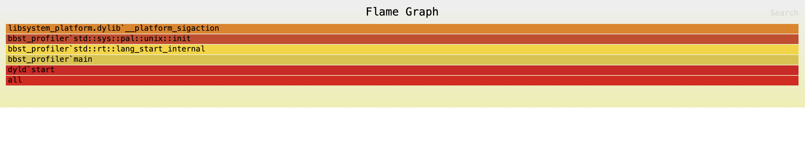

# Rust Application Profiling with Flamegraph

```
sudo cargo flamegraph
```

The Rust application will run, and the flamegraph will be generated as `flamegraph.svg` in the current directory.

Open the `flamegraph.svg` file in a web browser to view performance hotspots.



